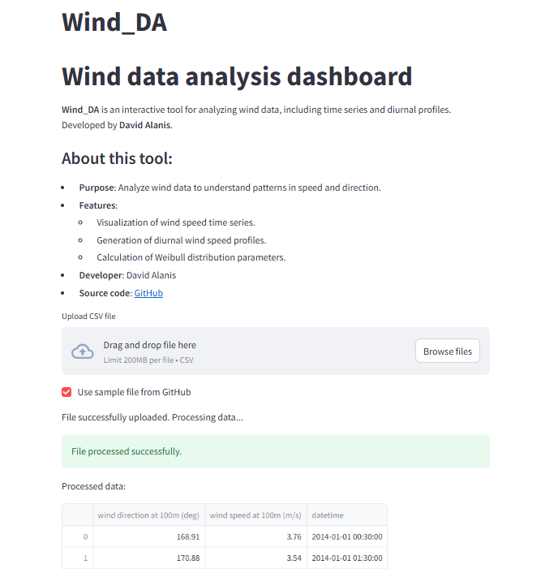

# 🌬️ WindDA - Wind Data Analysis  
🚀 Analyze wind speed data and visualize Weibull distributions with this web app.  

🔗 **[Launch the App](https://windda-tgrqwip3bvb9rnvlodrhxf.streamlit.app/)**  

## 📌 Features  
- Weibull distribution fitting  
- Wind speed histograms  
- Interactive plots  

## 📷 App  

## 🛠️ How to Use  
1. Upload your wind speed dataset 📊  
2. View Weibull parameters ⚙  
3. Analyze wind energy potential 🌍  

---
